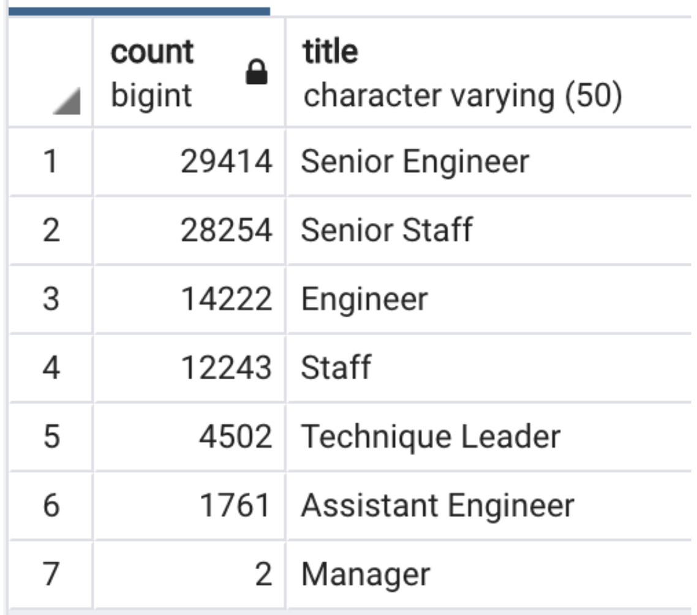
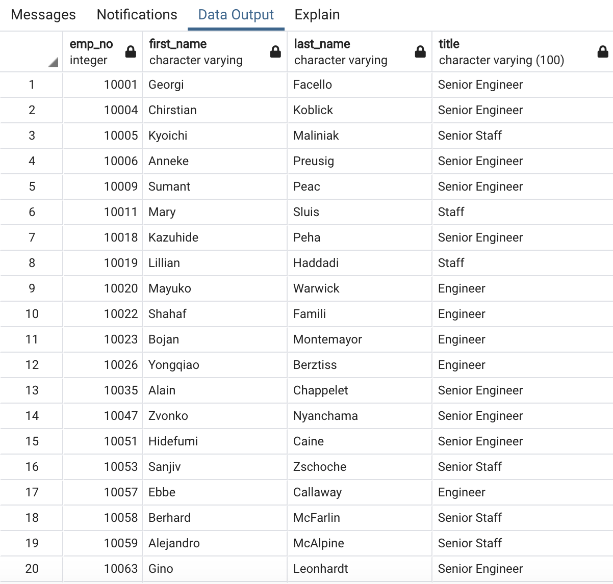
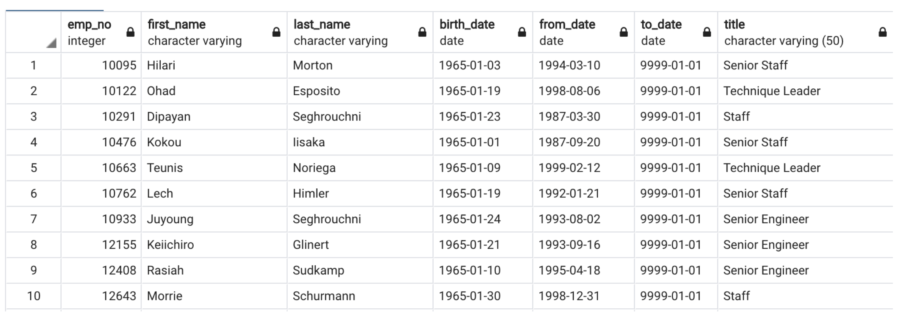

# Pewlett-Hackard-Analysis

## Overview of Analysis 
The purpose of this Pewlett Hackard analysis is to help the company find the number of people in the company who are going to retire and how many of them are going to retire and grouping them into different departments they work in. This will help the company find out how many empty places they need to fill in for the near future. 

## Overview of Analysis 
•	 From our retiring titles table, we found out that the largest number of employees that are going to retire are Senior Engineers and the lowest number of employees that are going to retire are managers.

•	From our retirement tables, I found out that many employees took on multiple roles throughout their time at Pewlett Hackard. Some employees had taken up two positions in their time at the company, while others took three roles. 

•	I found from the unique tables that there are 90,398 rows, meaning that there are 90,398 employees that are going to retire which is a lot of people. 

•	I noticed that the only requirements that need to be met for the mentorship program is that they have to be employees of the company that were born from January 1, 1965 to December 31, 1965.

## Images

## Summary 

From finding out that there are 90,398 rows in the unique tables, this means that there are 90,398 rows that need to be filled as the “silver tsunami” begins to make an impact. In addition, after finding out the number of rows in the table for mentorship eligibility, we now know that there are not enough retirement ready employees in the departments to mentor the next generation of Pewlett Hackard employees. 
